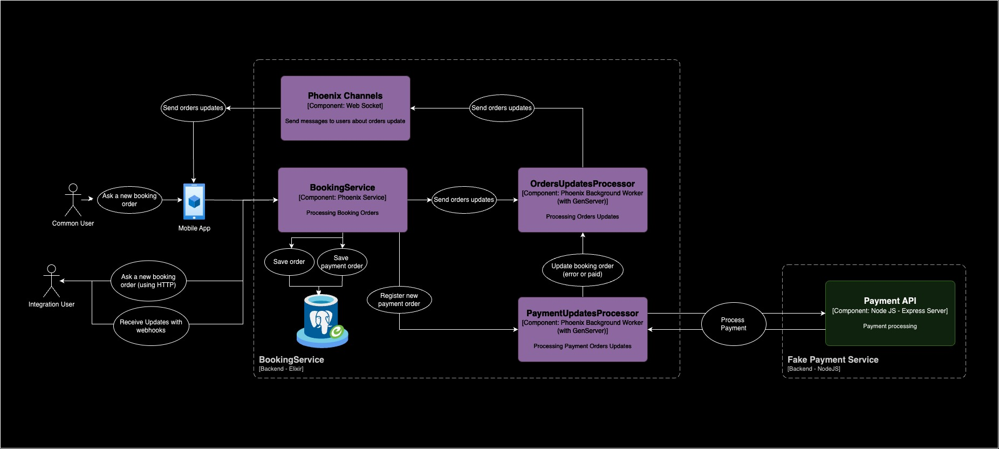

# Booking Storage Service
This service is responsible for processing booking storage orders for common users and for business users too;


## Architecture Components:
### Booking Service:
This is the main application that contains the business logic of the service. The use cases of service are in: BookingService.OrdersManagement

Source: 
- [booking_service/application.ex](./booking_service/lib/booking_service/application.ex)
- [booking_service/orders_management.ex](./booking_service/lib/booking_service/orders_management.ex)

The communication with this service is done by HTTP requests implemented in the BookingServiceWeb module. Sources:
- [booking_service_web/controllers/orders_controller.ex](./booking_service/lib/booking_service_web/controllers/orders_controller.ex)
- [booking_service_web/controllers/items_classification_controller.ex](./booking_service/lib/booking_service_web/controllers/items_classification_controller.ex)
- [booking_service_web/router.ex](./booking_service/lib/booking_service_web/router.ex)

### Phoenix Channels (Booking Service Web Sockets):
This is the module that is responsible to send orders updates for the communication between the service and the clients. It is implemented in the BookingServiceWeb module. 
Sources:
- [booking_service_web/channels/orders_channel.ex](./booking_service/lib/booking_service_web/channels/orders_channel.ex)
- [booking_service_web/endpoint.ex](./booking_service/lib/booking_service_web/endpoint.ex)
- [booking_service_web/router.ex](./booking_service/lib/booking_service_web/router.ex)

### Orders Update Processor Worker:
This worker is responsible to process the orders updates and send the updates to the clients. It is implemented in the BookingService and communicates directly with the web sockets module.

Source: [booking_service/orders_worker.ex](./booking_service/lib/booking_service/orders_worker.ex)

### Payments Processor Worker:
This worker is responsible to process the payments of the orders. It is implemented in the BookingService and communicates directly with the fake payment service sending orders and awaiting the payment status, after getting the payment status it updates the order status.

Source: [booking_service/payment_worker.ex](./booking_service/lib/booking_service/payment_worker.ex)

### Fake Payment Service:
This is a fake service that simulates the payment service. It is implemented in the FakePaymentService module. It is used to simulate the payment service and return the payment status for the orders.
Source: [./payment-service/index.js](./payment-service/index.js)

## Domain:

### Order
Booking order is the main entity of the service, it represents the order of a customer to store items in a store. It can contain multiple items and the total value of the order is calculated based on the items and the store. The status of the order can be: "started", "filled", "paid", "booked", "failed", "canceled";

<b>The successful flow of an order is:</b>
started -> filled -> paid -> booked

Source: 
- [booking_service/orders/order.ex](./booking_service/lib/booking_service/orders/order.ex)
- [booking_service/orders/order_item.ex](./booking_service/lib/booking_service/orders/order_item.ex)

#### Attributes:
- id: UUID
- store_id: UUID
- customer_id: UUID
- status: Enum
- total_value: Decimal
- inserted_at: DateTime
- updated_at: DateTime
- payment_order_id: UUID
- items: List of OrderItem
- customer: Customer
- store: Store
- payment_order: PaymentOrder

### Store
Store is the entity that represents the place where the items will be stored. It has a name, id and the orders on this store.
Source: 
- [booking_service/stores/store.ex](./booking_service/lib/booking_service/stores/store.ex)
  
### Payment Order
Payment Order is the entity that represents the payment order of the order. It has the status of the payment and total value of the order.
Source: 
- [booking_service/payments/payment_order.ex](./booking_service/lib/booking_service/payments/payment_order.ex)

### Items Classification
Items Classification is the entity that represents the possible items to store in the store. It has a name and the value to store the item.
Source: 
- [booking_service/items/classification.ex](./booking_service/lib/booking_service/items/classification.ex)
    
### Customer
Customer is the entity that represents the customer that is making the order. It has a name and email.
Source: 
- [booking_service/orders/customer.ex](./booking_service/lib/booking_service/orders/customer.ex)

## How it runs
#### Setup Database & UP fake payment service:
```bash
docker-compose up -d
```

#### Run the service:

Go to service:
```bash
cd booking_service
```

Install deps:
```bash
mix deps.get
```

Run migrations:
```bash
mix ecto.setup
```

Feed Database:
```bash
mix run priv/repo/seeds.exs
```


Run the service:
```bash
mix phx.server
```

### Run tests:
```bash
mix test
```

### Postman Collections:

Are in the folder ./collections


### API Documentation:

#### Use cases:

Start checkout:
URL: http://localhost:4000/api/orders 
Method: POST
Body:
```json
{
  "store_id": "236584ee-58e2-42fd-a4d4-e08133bbbb6b"
}
```

Fill Checkout:
http://localhost:4000/api/orders/{order_id}
Method: PUT
Body:
```json
{
  "store": {
    "id": "236584ee-58e2-42fd-a4d4-e08133bbbb6b"
  },
  "items": [
    {
      "name": "Bags Storage",
      "quantity": 1
    }
  ],
  "customer": {
    "name": "Cody",
    "email": "fabricioms.dev@gmail.com"
  },
  "payment_order": {
    "credit_card": "1234 5678 9012 3456",
    "cvv": "123",
    "expiration_date": "12/23"
  }
}
```

Get Order:
URL: http://localhost:4000/api/orders/{order_id}
Method: GET
Response:
```json
{
  "error": "Payment order failed",
  "id": "0bff6c84-9d5e-4c53-8d5b-99b4e1a498d5",
  "status": "failed",
  "total_value": 10
}
```

Get possible products to store:
URL: http://localhost:4000/api/classifications
Method: GET
```json
[
  {
    "id": "8e73da91-015c-4c11-8871-96dc799a65e6",
    "name": "Bags Storage",
    "value_to_store": 10,
    "inserted_at": "2024-08-23T01:52:35Z",
    "updated_at": "2024-08-23T01:52:35Z"
  },
  {
    "id": "305a0b83-e7f1-495c-aed5-47a4658ac815",
    "name": "Boxes Storage - Business Logistics",
    "value_to_store": 20,
    "inserted_at": "2024-08-23T01:52:35Z",
    "updated_at": "2024-08-23T01:52:35Z"
  },
  {
    "id": "32e97b20-7991-4acd-a2f8-e3697b0cc216",
    "name": "Large Items Storage - Business Logistics",
    "value_to_store": 30,
    "inserted_at": "2024-08-23T01:52:35Z",
    "updated_at": "2024-08-23T01:52:35Z"
  }
]
```